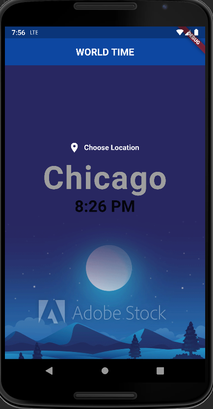
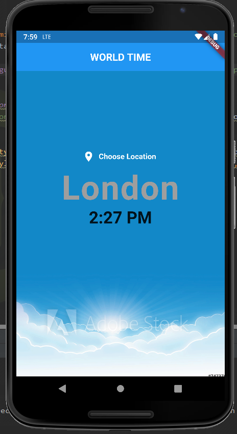
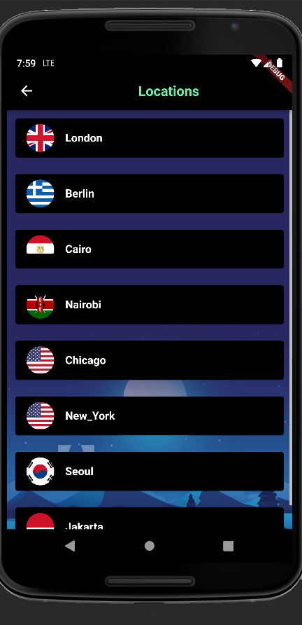

# World_time_app

This flutter application enables the user to view the time of a set of countries in the world.

It uses the world time api for fetching the world time data.

## Home Page:

### This page displays the time of the location of our choice:

## Change Location Page:

### This page enables us to choose from a set of locations whose time we want to know:

